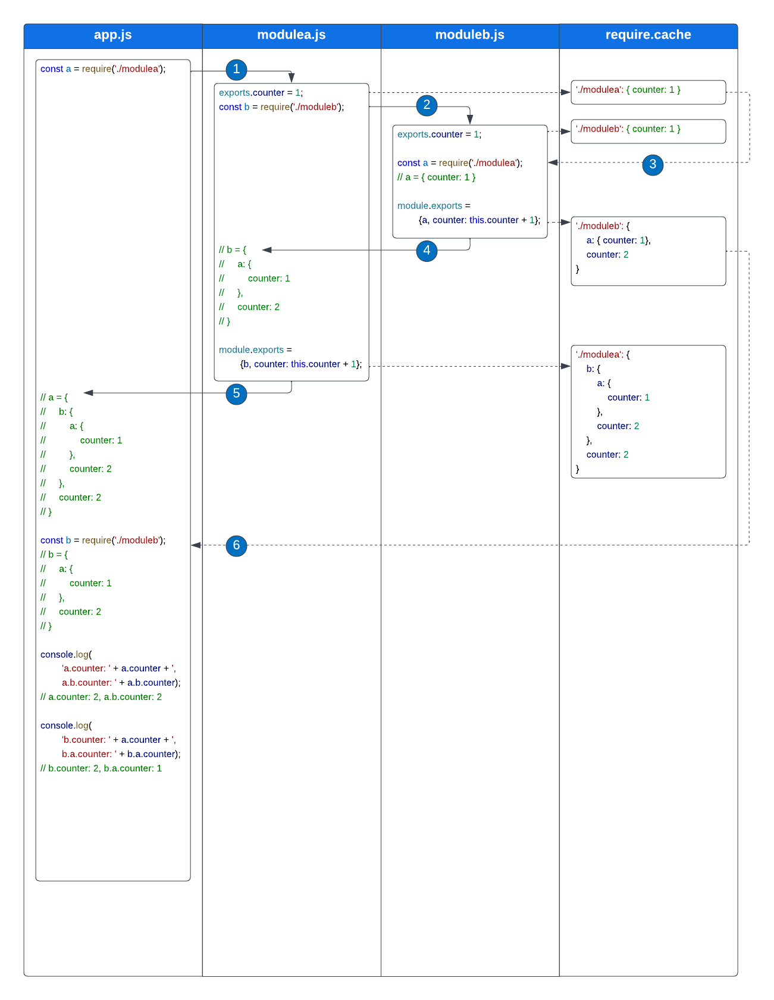

# Introduction
This is a simple contrived application to illustrate how NodeJS  handles circular dependencies. It is based on (and inspired by) the blog article by [Sankarsan on the same topic](https://sankarsan.wordpress.com/2021/08/15/circular-dependency-in-node-js-modules/).

# How to Run
This program requires [NodeJS](https://nodejs.org/). To run it, simply use:
`npm run test`

It is recommended that you use a debugger so you can observe what's happening in the code at each step.

# Explanation
For background, I recommend starting with [Sankarsan's blog post on circular dependencies](https://sankarsan.wordpress.com/2021/08/15/circular-dependency-in-node-js-modules/).

This example application consists of three pieces of code:
* `modulea.js` - "Module A" - a simple CommonJS module; it has a dependency on Module B.
* `moduleb.js` - "Module B" - another simple CommonJS module; it has a dependency on Module A.
* `app.js` - the main application; it has dependencies on both Module A and Module B.

The annotations in the code and in the flowchart below describe in detail what happens when a program tries to load Modules A and B, which have dependencies on each other. The step numbers noted in the code correspond to the numbers in the diagram below.

# Further Reading
For a more comprehensive overview of Javascript modules, I recommend the ["Modules" chapter of Marijn Haverbeke's *Eloquent Javascript*](https://eloquentjavascript.net/10_modules.html). 

For a clear explanation how `exports` works, I recommend [this StackOverflow post](https://stackoverflow.com/a/26451885).